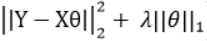

```{r setup, include=FALSE}
knitr::opts_chunk$set(echo = TRUE)
```

# Executive summary

# Loading and exploring

## Load libraries and data

```{r message=FALSE}
options(scipen=999)
library(ggplot2)
library(caret)
library(dplyr)
library(psych)  
library(scales)
library(corrplot)
library(ggrepel)
library(plyr)
library(DMwR)
library(gridExtra)
library(lubridate)
library(Boruta)
library(bestNormalize)
library(xgboost)
set.seed(1101)
```
```{r}
train <- read.csv('train.csv', stringsAsFactors = FALSE)
test <- read.csv('test.csv', stringsAsFactors = FALSE)
```

## Data overview

- There are character and numeric features
- Character are mostly factors but reading them as char first to facilitate clean-up / feature engineering
- total of 80 predictors + 1 response variable SalePrice

```{r}
dim(train)
str(train[,c(1:10,81)])
```

Do not need the IDs for prediction, but do need them for submission, therefore store test IDs separately and remove them from data sets.

```{r}
test_Ids <- test$Id
train$Id <- NULL
test$Id <- NULL
```

Add NA SalePrice to test set and then stack it vertically with the train set. <span style="color: red;">This is a questionable practice as it may lead to data leakage from the test set (namely, feature distribution parameters).</span> But it is very convenient to do all the data transformations together on a single data set, and for competition purpose, since we know the test set distribution already, it is fair game to use it. We'll probably end up overfitting to the test set, but have a higher leader board score in the end.

```{r}
test$SalePrice <- NA
all <- rbind (train, test)
dim(all)
```
We're left with one data set of 79 predictors and 1 response variable.

## SalePrice

The plot below shows that SalePrice is positively skewed (has a long right tail, or in other words, median is lower than mean). This is to be expected as there will always be a small number of very expensive houses. Most prediction models work best for normally distributed variables, this can be fixed by applying a log transformation before prediction.

```{r}
ggplot(data=all[!is.na(all$SalePrice),], aes(SalePrice)) +
        geom_histogram(aes(y=..density..), fill="steelblue", binwidth = 15000) +
        geom_density(size=1) +
        geom_vline(aes(xintercept=mean(SalePrice)), col='red', linetype='dashed') +
        geom_text(aes(x=mean(SalePrice), y=.000001), label='\nMean', angle=90) +
        geom_vline(aes(xintercept=median(SalePrice)), col='green', linetype='dashed') +
        geom_text(aes(x=median(SalePrice)-18000, y=.000001), label='Median', angle=90) +
        scale_x_continuous(breaks= seq(0, 800000, by=100000), labels=comma)
                       
```

## Numeric predictors

Let's leave the character/factor predictors aside for now, and understand the numeric ones.

### Overview

```{r}
numericPredictors <- which(sapply(all, is.numeric))
numericPredNames <- names(numericPredictors)
cat('There are', length(numericPredNames), 'numeric predictors')
```

Here I calculate pairwise correlations of all the features (including SalePrice), leave only those with |corr| > .5 and plot them sorted in descending order. Note that <span style="color: red;">because of NA values I need to use pairwise.complete.obs</span> which can give misleading results by comparing different pairs of vectors in each case, but here I'm just trying to find the most important features for further analysis.

```{r}
all_numPred <- all[,numericPredictors]
cor_matrix <- cor(all_numPred, use="pairwise.complete.obs")
cor_sorted <- sort(cor_matrix[,'SalePrice'], decreasing=TRUE)
cor_high <- names(which(sapply(cor_sorted, function(x) abs(x)>.5)))
cor_matrix <- cor_matrix[cor_high, cor_high]
corrplot.mixed(cor_matrix, tl.col='black', tl.pos='lt')
```
There are 10 predictors highly correlated with SalePrice. Some of them are also highly correlated with each other, e.g. GarageCars - GarageArea, TotalBsmtSF - X1stFlrSF etc. I will have to deal with them later by removing some.

### Overall Quality

OverallQual has the highest correlation with SalePrice among all features (.79). It ranges from 1 (very poor) to 10 (very excellent). While it is a numeric feature, it only comes at discrete natural values, so it makes sense to plot the distribution for each quality as a boxplot.

There is an obious upward trend (visually stronger than just linear, maybe cuadratic or exponential). Quite a few outliers with the most extreme ones at levels 4 and 10.

```{r}
ggplot(data = all[!is.na(all$SalePrice),], aes(x=factor(OverallQual), y=SalePrice)) +
        geom_boxplot(color='steelblue', 
                     outlier.color = 'black', outlier.shape = 1) +
        labs(x='Overall Quality') + 
        scale_y_continuous(breaks= seq(0, 800000, by=100000), labels = comma) +
        geom_text_repel(aes(label=ifelse(all[!is.na(all$SalePrice),'SalePrice']>650000 | all[!is.na(all$SalePrice),'SalePrice']>200000 & all[!is.na(all$SalePrice),'OverallQual']==4,rownames(all),'')), col=2)
```

### Living area

GrLivArea is "Above grade (ground) living area square feet" and the second most correlated with SalePrice feature. This one is truly continuous so a scatter plot makes sense. There are two big time outliers that I may need to deal with later.

```{r}
ggplot(data=all[!is.na(all$SalePrice),], aes(x=GrLivArea, y=SalePrice)) +
        geom_point(col='steelblue', alpha=.5) +
        geom_smooth(method='lm') +
        labs(x='Living Area') + 
        scale_y_continuous(breaks= seq(0, 800000, by=100000), labels = comma) +
        geom_text_repel(aes(label=ifelse(all[!is.na(all$SalePrice),'GrLivArea']>4500,rownames(all),'')), col=2)
```

### Garage Capacity

The third strongly correlated with SalePrice predictor is GarageCars (Size of garage in car capacity). This will be the last one I plot in this section.

```{r}
ggplot(data = all[!is.na(all$SalePrice),], aes(x=factor(GarageCars), y=SalePrice)) +
        geom_boxplot(color='steelblue', 
                     outlier.color = 'black', outlier.shape = 1) +
        labs(x='Garage Capacity') + 
        scale_y_continuous(breaks= seq(0, 800000, by=100000), labels = comma) +
        geom_text_repel(aes(label=ifelse(all[!is.na(all$SalePrice),'SalePrice']>650000,rownames(all),'')), col=2)
```

# Missing data; factor and date predictors

These are all the columns with NA data, sorted by the number of NAs. Some of these features forms groups (Pool, Garage etc). I will deal with NAs group by group, going top to bottom. As I go, I will convert character features to either integers (where they are obviously ordered) or to factors otherwise.

```{r}
NA_cols <- sapply(all[,-80], function(x) sum(is.na(x)))
sort(NA_cols[NA_cols != 0], decreasing=TRUE)
```

## Fix NA {.tabset}

### Pool

**Fix NA**

PoolQC has most NAs at 2909 total. However, according to data description:

PoolQC: Pool quality
		
       Ex	Excellent
       Gd	Good
       TA	Average/Typical
       Fa	Fair
       NA	No Pool

NA here simply means no pool. Not cool, data set creator, not cool! using NA to represent an actual known value.

```{r}
all[is.na(all$PoolQC),'PoolQC'] <- 'None'
```

**Check for inconsistencies**

There is a second pool variable, PoolArea. The weird thing about it is that there are 3 houses that have pool area specified, but according to PoolQC they do not have a pool! I'm listing here OverallQual and YearBuilt as they are also indicators of quality.

```{r}
all[all$PoolQC=='None' & all$PoolArea!=0,c('PoolQC', 'PoolArea', 'OverallQual', 'YearBuilt')]
```

I assume this is a data entry error: these 3 houses do have a pool but it's quality is unknown so let's impute it based on OverallQual and YearBuilt.

```{r}
all[all$PoolQC!='None' & all$OverallQual <= 6,c('PoolQC', 'PoolArea', 'OverallQual', 'YearBuilt')]
```

Houses with OverallQual=6 have PoolQC either Fa(ir) or G(oo)d. Houses with 5 or less never have a pool. Let's give the 6-quality house a TA pool (between Good and Fair) and for the two others, a Fa(ir) one (one step above None).

```{r}
all$PoolQC[2504] <- 'TA'
all$PoolQC[c(2421,2600)] <- 'Fa'
```

**Convert to integer**

Pool quality is obviously ordered, so we can convert it to an integer.
I will create a conversion dictionary to be reused on other variables. I add "Poor" level which is not present here but will be in others, it will create a wider gap between no pool (0) and some pool (2+) than between adjacent levels of "some pool".

```{r}
quality <- c('None' = 0, 'Po' = 1, 'Fa' = 2, 'TA' = 3, 'Gd' = 4, 'Ex' = 5)
all$PoolQC <- as.integer(revalue(all$PoolQC, quality))
table(all$PoolQC)
```
Very few houses have pools BTW.

### Misc Feature

There are two variables telling about some extra feature of the house.

MiscFeature: Miscellaneous feature not covered in other categories
		
       Elev	Elevator
       Gar2	2nd Garage (if not described in garage section)
       Othr	Other
       Shed	Shed (over 100 SF)
       TenC	Tennis Court
       NA	None
MiscVal: $Value of miscellaneous feature

**Fix NA and check for inconsistencies**

MiscFeature has 2814 NAs which we again can replace with None. Let's also do the same test: find houses that have a non-zero MiscVal but no MiscFeature listed.
```{r}
all[is.na(all$MiscFeature),'MiscFeature'] <- 'None'
all[all$MiscFeature=='None' & all$MiscVal!=0,c('MiscFeature', 'MiscVal', 'OverallQual', 'YearBuilt')]
```

There is one house with a $17,000 something. A new and excellent quality one, too!

```{r}
ggplot(data=all, aes(x=MiscFeature, y=MiscVal)) + geom_boxplot() +
        geom_text_repel(aes(label=ifelse(rownames(all)==2550,rownames(all),'')), col=2)
```

The only thing that can cost $17,000 is a second garage.
```{r}
all$MiscFeature[2550] <- 'Gar2'
```

**Conver to factor**

Misc feature cannot be ordered in any sensible way, so I'll convert it to factor for now. Later all the factor variables will have to be one-hot encoded as not all the models can deal with factors.

```{r}
all$MiscFeature <- as.factor(all$MiscFeature)
```

### Alley

Alley: Type of alley access to property

       Grvl	Gravel
       Pave	Paved
       NA 	No alley access
```{r}
all$Alley[is.na(all$Alley)] <- 'None'
```

It may seem that a paved alley is better than gravel, and gravel better than none. However

```{r}
ggplot(data=all[!is.na(all$SalePrice),], aes(x=Alley, y=SalePrice)) +
        geom_boxplot()
```

So let's keep it as factor.

```{r}
all$Alley <- as.factor(all$Alley)
```

### Fence

Fence: Fence quality
		
       GdPrv	Good Privacy
       MnPrv	Minimum Privacy
       GdWo	Good Wood
       MnWw	Minimum Wood/Wire
       NA	No Fence
```{r}
all$Fence[is.na(all$Fence)] <- 'None'
ggplot(data=all[!is.na(all$SalePrice),], aes(x=Fence, y=SalePrice)) +
        geom_boxplot()
```

Again no obvious order, keeping as factor.
```{r}
all$Fence[is.na(all$Fence)] <- as.factor(all$Fence)
```

### Fireplace

Fireplaces: Number of fireplaces

FireplaceQu: Fireplace quality

       Ex	Excellent - Exceptional Masonry Fireplace
       Gd	Good - Masonry Fireplace in main level
       TA	Average - Prefabricated Fireplace in main living area or Masonry Fireplace in basement
       Fa	Fair - Prefabricated Fireplace in basement
       Po	Poor - Ben Franklin Stove
       NA	No Fireplace

**Fixing NA and checking for inconsistencies**

No data errors this time.
```{r}
all$FireplaceQu[is.na(all$FireplaceQu)] <- 'None'
all[all$FireplaceQu=='None' & all$Fireplaces!=0,c('FireplaceQu', 'Fireplaces', 'OverallQual', 'YearBuilt')]
```

**Convert to integer**

The quality dictionary comes handy.
```{r}
all$FireplaceQu <- as.integer(revalue(all$FireplaceQu, quality))
table(all$FireplaceQu)
```

### Lot Properties

LotFrontage is the only variable in this group that has NAs. There are also LotArea, LotShape and LotConfig.

```{r}
head(all[is.na(all$LotFrontage), c('LotFrontage', 'LotArea', 'LotShape', 'LotConfig')])
```

**Deal with factors**

I deal with LotShape and LotConfig first because I will use them for imputation and it helps to have all the variables properly formatted.
LotShape: General shape of property

       Reg	Regular	
       IR1	Slightly irregular
       IR2	Moderately Irregular
       IR3	Irregular
LotConfig: Lot configuration

       Inside	Inside lot
       Corner	Corner lot
       CulDSac	Cul-de-sac
       FR2	Frontage on 2 sides of property
       FR3	Frontage on 3 sides of property
```{r}
# LotShape is ordered, regular is best
shapes <- c('IR3'=0, 'IR2'=1, 'IR1'=2, 'Reg'=3)
all$LotShape <- as.integer(revalue(all$LotShape, shapes))

# LotConfig is not ordered, keeping as factor
all$LotConfig <- as.factor(all$LotConfig)
```

**Impute missing data**

This will be the first time I actually impute missing data, as opposed to just changing NA to None or fixing obvious data entry errors. KNN imputation based on the remaning lot variables seems reasonable. knn.impute function from bnstruct package was glitching but knnImputation from DMwR worked fine with default parameters (k=10, impute with weighted average).

```{r}
summary(all$LotFrontage)
lot <- all[,c('LotFrontage', 'LotArea', 'LotShape', 'LotConfig')]
lot$LotShape <- as.factor(lot$LotShape)
lot$LotConfig <- as.factor(lot$LotConfig)
lot <- knnImputation(lot)
all$LotFrontage <- lot$LotFrontage
summary(all$LotFrontage)
```
Mean changed by less than a foot and median by less than two. All NAs are gone.

### Garage

Seven variables describe the garage: GarageType, GarageYrBlt, GarageFinish, GarageCars, GarageArea, GarageQual and GarageCond. All of them have at least one missing value. Let's deal with them one by one. First the easy ones for which NA means no garage according to data description.

GarageType: Garage location
		
       2Types	More than one type of garage
       Attchd	Attached to home
       Basment	Basement Garage
       BuiltIn	Built-In (Garage part of house - typically has room above garage)
       CarPort	Car Port
       Detchd	Detached from home
       NA	No Garage

GarageFinish: Interior finish of the garage

       Fin	Finished
       RFn	Rough Finished	
       Unf	Unfinished
       NA	No Garage
       
GarageQual: Garage quality

       Ex	Excellent
       Gd	Good
       TA	Typical/Average
       Fa	Fair
       Po	Poor
       NA	No Garage
		
GarageCond: Garage condition

       Ex	Excellent
       Gd	Good
       TA	Typical/Average
       Fa	Fair
       Po	Poor
       NA	No Garage

**Fix NA**

GarageQual and GarageCond seem to be the same. I may drop one of them at the feature selection stage.
       
```{r}
all$GarageType[is.na(all$GarageType)] <- "None"
all$GarageFinish[is.na(all$GarageFinish)] <- "None"
all$GarageQual[is.na(all$GarageQual)] <- "None"
all$GarageCond[is.na(all$GarageCond)] <- "None"
```

That leaves me with GarageYrBuilt, GarageCars and GarageArea.

```{r}
garage <- all[,c('GarageType', 'GarageYrBlt', 'GarageFinish', 'GarageCars', 'GarageArea', 'GarageQual', 'GarageCond')]
garage[is.na(garage$GarageCars) | is.na(garage$GarageArea),]
head(garage[is.na(garage$GarageYrBlt),])
```

The one house that has GarageCars and GarageArea missing simply has no garage. It does have GarageType = Detchd for some reason, I'll assume it is an error and change GarageType to None. All the others do not have a garage either, but we need to fill the GarageYrBlt with something nevertheless. One choice is to use the year when the house itself was built.

```{r}
garage$GarageType[2577] <- "None"
garage$GarageCars[2577] <- 0
garage$GarageArea[2577] <- 0
garage$GarageYrBlt[is.na(garage$GarageYrBlt)] <- all$YearBuilt[is.na(all$GarageYrBlt)]
```

**Check for inconsistencies**

Except for GarageYrBlt that cannot be blank, all the other variables should either be None/0 all together, or none of them.

```{r}
d <- matrix(nrow=6, ncol=2)
d[1,] <- dim(garage[garage$GarageType=='None',])
d[2,] <- dim(garage[garage$GarageFinish=='None',])
d[3,] <- dim(garage[garage$GarageQual=='None',])
d[4,] <- dim(garage[garage$GarageCond=='None',])
d[5,] <- dim(garage[garage$GarageCars==0,])
d[6,] <- dim(garage[garage$GarageArea==0,])
d
```

There are 159 houses with GarageFinish, GarageQual and GarageCond equal to None, but only 158 such that GarageType, GarageArea or GarageCars are None/0. Let's find the gap.

```{r}
g158 <- garage$GarageType=='None' | garage$GarageArea==0 | garage$GarageCars==0
g159 <- garage$GarageFinish=='None' & garage$GarageQual=='None' & garage$GarageCond=='None'
garage[g159 & !g158,]
```
There is one 1910 (sic!) garage for one car with some area that has GarageFinish, GarageQual and GarageCond missing. As this is just one house, I will fill the garage data with most common values, then check again for consistency.

```{r}
garage$GarageFinish[2127] <- 'Unf'
garage$GarageQual[2127] <- 'TA'
garage$GarageCond[2127] <- 'TA'
d[1,] <- dim(garage[garage$GarageType=='None',])
d[2,] <- dim(garage[garage$GarageFinish=='None',])
d[3,] <- dim(garage[garage$GarageQual=='None',])
d[4,] <- dim(garage[garage$GarageCond=='None',])
d[5,] <- dim(garage[garage$GarageCars==0,])
d[6,] <- dim(garage[garage$GarageArea==0,])
d
```
Great, 158 of everything. 

**Deal with factors**

Out of our seven variables:

- GarageYrBlt, GarageCars, GarageArea are already integer
- GarageQual and GarageCond can be integerized with quality dictionary
- GarageFinish has its own order
- GarageType stays as factor

```{r}
garage$GarageQual <- as.integer(revalue(garage$GarageQual, quality))
garage$GarageCond <- as.integer(revalue(garage$GarageCond, quality))
gfinish <- c('None'=0,'Unf'=1, 'RFn'=2, 'Fin'=3)
garage$GarageFinish <- as.integer(revalue(garage$GarageFinish, gfinish))
garage$GarageType <- as.factor(garage$GarageType)
all[,c('GarageType', 'GarageYrBlt', 'GarageFinish', 'GarageCars', 'GarageArea', 'GarageQual', 'GarageCond')] <- garage
```

### Basement

Another mega-group with 11 features: BsmtCond, BsmtQual, BsmtExposure, BsmtFinType1, BsmtFinType2, BsmtFinSF1, BsmtFinSF2, BsmtUnfSF, BsmtFullBath, BsmtHalfBath, TotalBsmtSF, all of which have some NAs.

**Deal with NA**

In five features, NA means no basement.
```{r}
all$BsmtQual[is.na(all$BsmtQual)] <- 'None'
all$BsmtCond[is.na(all$BsmtCond)] <- 'None'
all$BsmtExposure[is.na(all$BsmtExposure)] <- 'None'
all$BsmtFinType1[is.na(all$BsmtFinType1)] <- 'None'
all$BsmtFinType2[is.na(all$BsmtFinType2)] <- 'None'
```

In the remaining six, it probably means the same and can be substituted with 0 as they are numeric. However let's check.

```{r}
all[is.na(all$BsmtFinSF1) | is.na(all$BsmtFinSF2) | is.na(all$BsmtUnfSF) | is.na(all$BsmtFullBath) | is.na(all$BsmtHalfBath) | is.na(all$TotalBsmtSF), c('BsmtCond', 'BsmtQual', 'BsmtExposure', 'BsmtFinType1', 'BsmtFinType2', 'BsmtFinSF1', 'BsmtFinSF2', 'BsmtUnfSF', 'BsmtFullBath', 'BsmtHalfBath', 'TotalBsmtSF')]
```

Just two houses with obviously no basement. Replacing those NAs with 0.
```{r}
all[c(2121,2189),c('BsmtFinSF1', 'BsmtFinSF2', 'BsmtUnfSF', 'BsmtFullBath', 'BsmtHalfBath', 'TotalBsmtSF')] <- 0
```

**Deal with factors**

BsmtQual and BsmtCond can be treated with quality dictionary.  BsmtExposure, BsmtFinType1 and BsmtFinType2 have their own.
```{r}
all$BsmtQual <- as.integer(revalue(all$BsmtQual, quality))
all$BsmtCond <- as.integer(revalue(all$BsmtCond, quality))
expo_dict <- c('None'=0, 'No'=1, 'Mn'=2, 'Av'=3, 'Gd'=4)
all$BsmtExposure <- as.integer(revalue(all$BsmtExposure, expo_dict))
fintype_dict <- c('None'=0, 'Unf'=1, 'LwQ'=2, 'Rec'=3, 'BLQ'=4, 'ALQ'=5, 'GLQ'=6)
all$BsmtFinType1 <- as.integer(revalue(all$BsmtFinType1, fintype_dict))
all$BsmtFinType2 <- as.integer(revalue(all$BsmtFinType2, fintype_dict))
```

Let's check for consistency. All the 11 variables should have the same amount of 0 (everything is encoded with 0 no, no string values).

```{r}
d <- c()
d[1] <- sum(all$BsmtCond==0)
d[2] <- sum(all$BsmtQual==0)
d[3] <- sum(all$BsmtExposure==0)
d[4] <- sum(all$BsmtFinType1==0)
d[5] <- sum(all$BsmtFinType2==0)
d[6] <- sum(all$BsmtFinSF1==0)
d[7] <- sum(all$BsmtFinSF2==0)
d[8] <- sum(all$BsmtUnfSF==0)
d[9] <- sum(all$BsmtFullBath==0)
d[10] <- sum(all$BsmtHalfBath==0)
d[11] <- sum(all$TotalBsmtSF==0)
d
```

Okay not all of them. BsmtFinSF1, BsmtFinSF2, BsmtUnfSF, BsmtFullBath and BsmtHalfBath can be zero even in a house wiht a basement (but no bathroom there or no finished / unfinished square feet). However, BsmtCond, BsmtQual, BsmtExposure, BsmtFinType1, BsmtFinType2 and TotalBsmtSF should only be zero for the houses with no basement, that it, the same amoutn of them.

```{r}
all[(all$BsmtCond==0 | all$BsmtExposure==0 | all$BsmtQual==0) & all$TotalBsmtSF!=0,c('BsmtCond', 'BsmtQual', 'BsmtExposure', 'BsmtFinType1', 'BsmtFinType2', 'TotalBsmtSF')]
```

Three problematic houses show basement exposure as 0 (no basement), but they do have other fields filled in, so probably there is a basement. They all have BsmtCond=3 and BsmtQual=4, and such houses mostly have no exposure (BsmtExp=1 in my encoding).

```{r}
table(all$BsmtExposure[all$BsmtCond==3 & all$BsmtQual==4])
```

Three more have BsmtCond=0 (no basement), but again all the other variables filled in. Judging by BsmtQual, they should have BsmtCond=3.
```{r}
table(all$BsmtCond[all$BsmtQual %in% c(3,4)])
```

Yet two more have BsmtQual=0 with all the others filled in. They will get BsmtCond of 3 (yes, if you check for BsmtCond 2 and 3 separately, you will get the same result).

```{r}
table(all$BsmtQual[all$BsmtCond %in% c(2,3)])
```

Fix exposure, condition and quality, check everything again.
```{r}
all$BsmtExposure[c(949,1488,2349)] <- 1
all$BsmtCond[c(2041, 2186, 2525)] <- 3
all$BsmtQual[c(2218,2219)] <- 3
d <- c()
d[1] <- sum(all$BsmtCond==0)
d[2] <- sum(all$BsmtQual==0)
d[3] <- sum(all$BsmtExposure==0)
d[4] <- sum(all$BsmtFinType1==0)
d[5] <- sum(all$BsmtFinType2==0)
d[5] <- sum(all$TotalBsmtSF==0)
d
``` 

Incredible! 


### Masonry Veneer and Exterior

MasVnrType: Masonry veneer type

       BrkCmn	Brick Common
       BrkFace	Brick Face
       CBlock	Cinder Block
       None	None
       Stone	Stone
	
MasVnrArea: Masonry veneer area in square feet

MasVnrType is missing 24 values. MasVnrArea is missing 23. Logically it makes sense combine the masonry veneer (the decorative stuff that covers the walls outside) with Exterior properties. Many of possible exterior coverings are the same materials mentioned in veneer.

Exterior1st: Exterior covering on house

       AsbShng	Asbestos Shingles
       AsphShn	Asphalt Shingles
       BrkComm	Brick Common
       BrkFace	Brick Face
       CBlock	Cinder Block
       CemntBd	Cement Board
       HdBoard	Hard Board
       ImStucc	Imitation Stucco
       MetalSd	Metal Siding
       Other	Other
       Plywood	Plywood
       PreCast	PreCast	
       Stone	Stone
       Stucco	Stucco
       VinylSd	Vinyl Siding
       Wd Sdng	Wood Siding
       WdShing	Wood Shingles

Exterior2nd: Exterior covering on house (if more than one material)

ExterQual: Evaluates the quality of the material on the exterior 
		
       Ex	Excellent
       Gd	Good
       TA	Average/Typical
       Fa	Fair
       Po	Poor

ExterCond: Evaluates the present condition of the material on the exterior
		
       Ex	Excellent
       Gd	Good
       TA	Average/Typical
       Fa	Fair
       Po	Poor

**Deal with NA**

```{r}
exterior <- all[,c('MasVnrType', 'MasVnrArea', 'Exterior1st', 'Exterior2nd', 'ExterQual', 'ExterCond')]
table(exterior$Exterior1st[is.na(exterior$MasVnrType)])
```

That means, none of the houses with missing MasVnrType have any kind of brick or stone on the exterior (although this values do exist in other rows), which probably means no masonry veneer. One value in Exterior1st is NA, let's keep that row for now and fix the rest of the MasVnrType to None and MasVnrArea to 0.

```{r}
exterior$MasVnrType[is.na(exterior$MasVnrType) & !is.na(exterior$Exterior1st)] <- 'None'
exterior$MasVnrArea[is.na(exterior$MasVnrArea) & !is.na(exterior$Exterior1st)] <- 0
exterior[rowSums(is.na(exterior))>0,]
```

I'm left with one case opposite of what I just dealt with: MasVnrType and MasVnrArea are known to be None and 0 (and I did not fix these), but Exterior1st and 2nd are NA. Let's see what are the usual values.

```{r}
table(exterior$Exterior1st[exterior$MasVnrType=='None'])
```

The most popular exterior for houses without masonry veneer is apparently VinylSd (same for Exterior2nd BTW), let's assign this value to our one case. And then remember there was 24 missing MasVnrType but only 23 MasVnrArea? Let's look at that one too.

```{r}
exterior$Exterior1st[2152] <- 'VinylSd'
exterior$Exterior2nd[2152] <- 'VinylSd'
exterior[exterior$MasVnrType=='None' & exterior$MasVnrArea!=0,]
```

That means, apart from the one row that I fixed, there were 7 others that had MasVnrType=None but some area assigned. I will leave the ones with Area=1 unchanged as 1 is almost 0, but for the others I will change MasVnrType to the most common value.

```{r}
# Taking 2nd value as the 1st one is None
exterior$MasVnrType[exterior$MasVnrType=='None' & exterior$MasVnrArea>1] <- names(sort(-table(all$MasVnrType)))[2]
```

**Deal with factors**

ExterQual and ExterCond can be ordinalized with quality dictionary. Exterior1st and Exterior2nd have to stay as factors. MasVnrType is not clear yet.

```{r}
exterior$ExterQual <- as.integer(revalue(exterior$ExterQual, quality))
exterior$ExterCond <- as.integer(revalue(exterior$ExterCond, quality))
exterior$Exterior1st <- as.factor(exterior$Exterior1st)
exterior$Exterior2nd <- as.factor(exterior$Exterior2nd)
exterior$SalePrice <- all$SalePrice
ggplot(data=exterior[!is.na(exterior$SalePrice),], aes(x=MasVnrType, y=SalePrice)) + geom_boxplot()
```

While there is some difference in the median price between different veneers, it is also quite variable so I'll keep it is factor.

```{r}
exterior$MasVnrType <- as.factor(exterior$MasVnrType)
exterior$SalePrice <- NULL
all[,c('MasVnrType', 'MasVnrArea', 'Exterior1st', 'Exterior2nd', 'ExterQual', 'ExterCond')] <- exterior
```

### MSZoning and MSSubClass

MSZoning: Identifies the general zoning classification of the sale.
		
       A	Agriculture
       C	Commercial
       FV	Floating Village Residential
       I	Industrial
       RH	Residential High Density
       RL	Residential Low Density
       RP	Residential Low Density Park 
       RM	Residential Medium Density
       
MSSubClass: Identifies the type of dwelling involved in the sale.	

        20	1-STORY 1946 & NEWER ALL STYLES
        30	1-STORY 1945 & OLDER
        40	1-STORY W/FINISHED ATTIC ALL AGES
        45	1-1/2 STORY - UNFINISHED ALL AGES
        ..etc..
       
**Deal with NA**

MSZoning misses 4 values. Let's impute with mode for each neighbourhood.
```{r}
all[is.na(all$MSZoning),c('MSZoning', 'Neighborhood')]
```

```{r}
all$MSZoning[c(1916,2217,2251)] <- sort(names(-table(all$MSZoning[all$Neighborhood=='IDOTRR'])))[1]
all$MSZoning[2905] <- sort(names(-table(all$MSZoning[all$Neighborhood=='Mitchel'])))[1]
```

**Deal with factors**

MSZoning is definitely a factor, but more than that, MSSubClass is too, although represented by integer.

```{r}
all$MSSubClass <- as.factor(all$MSSubClass)
all$MSZoning <- as.factor(all$MSZoning)

#revalue MSSubClass for better readability
all$MSSubClass<-revalue(all$MSSubClass, c('20'='1 story 1946+', '30'='1 story 1945-', '40'='1 story unf attic', '45'='1,5 story unf', '50'='1,5 story fin', '60'='2 story 1946+', '70'='2 story 1945-', '75'='2,5 story all ages', '80'='split/multi level', '85'='split foyer', '90'='duplex all style/age', '120'='1 story PUD 1946+', '150'='1,5 story PUD all', '160'='2 story PUD 1946+', '180'='PUD multilevel', '190'='2 family conversion'))

```

### Utilities

Utilities: Type of utilities available
		
       AllPub	All public Utilities (E,G,W,& S)	
       NoSewr	Electricity, Gas, and Water (Septic Tank)
       NoSeWa	Electricity and Gas Only
       ELO	Electricity only

First I thought NA meant None. But the table shows that all but one houses have all utilitites.

```{r}
table(all$Utilities)
```

```{r}
all[is.na(all$Utilities) | all$Utilities=='NoSeWa', c('Utilities', 'SalePrice')]
```

1. The only house with NoSeWa is in training set
2. Both houses with NA are in test set
3. Everything else is AllPub

Imputing it to either AllPub or None would be useless for prediction (AllPub = no difference with others, None = no more data like this). This column can be dropped.

```{r}
all$Utilities <- NULL
```

### Functional

Functional: Home functionality (Assume typical unless deductions are warranted)

       Typ	Typical Functionality
       Min1	Minor Deductions 1
       Min2	Minor Deductions 2
       Mod	Moderate Deductions
       Maj1	Major Deductions 1
       Maj2	Major Deductions 2
       Sev	Severely Damaged
       Sal	Salvage only
       
Imputing with mode (which happens to by Typ) and ordering.
       
```{r}
all$Functional[is.na(all$Functional)] <- 'Typ'
func_dict <- c('Sal'=0, 'Sev'=1, 'Maj2'=2, 'Maj1'=3, 'Mod'=4, 'Min2'=5, 'Min1'=6, 'Typ'=7)
all$Functional <- as.integer(revalue(all$Functional, func_dict))
```


### Electrical

Electrical: Electrical system

       SBrkr	Standard Circuit Breakers & Romex
       FuseA	Fuse Box over 60 AMP and all Romex wiring (Average)	
       FuseF	60 AMP Fuse Box and mostly Romex wiring (Fair)
       FuseP	60 AMP Fuse Box and mostly knob & tube wiring (poor)
       Mix	Mixed
       
Impute one missing value to mode (SBrkr), keep as factor as no obvious ordering.

```{r}
all$Electrical[is.na(all$Electrical)] <- 'Sbrkr'
all$Electrical <- as.factor(all$Electrical)
```
### Kitchen

Kitchen: Kitchens above grade

KitchenQual: Kitchen quality

       Ex	Excellent
       Gd	Good
       TA	Typical/Average
       Fa	Fair
       Po	Poor

```{r}
all[is.na(all$KitchenQual),c('KitchenAbvGr', 'KitchenQual', 'OverallQual')]
```

I will impute with mode for OverallQual=5, then ordinalize.

```{r}
all$KitchenQual[1556] <- names(sort(-table(all$KitchenQual[all$OverallQual==5])))[1]
all$KitchenQual <- as.integer(revalue(all$KitchenQual, quality))
```

### SaleType

SaleType: Type of sale
		
       WD 	Warranty Deed - Conventional
       CWD	Warranty Deed - Cash
       VWD	Warranty Deed - VA Loan
       New	Home just constructed and sold
       COD	Court Officer Deed/Estate
       Con	Contract 15% Down payment regular terms
       ConLw	Contract Low Down payment and low interest
       ConLI	Contract Low Interest
       ConLD	Contract Low Down
       Oth	Other

Impute with mode, keep as factor.
```{r}
all$SaleType[is.na(all$SaleType)] <- names(sort(-table(all$SaleType)))[1]
all$SaleType <- as.factor(all$SaleType)
```

### Final NA check
```{r}
NA_cols <- sapply(all[,-80], function(x) sum(is.na(x)))
sort(NA_cols[NA_cols != 0], decreasing=TRUE)
```

Awesome, the only remaining NAs are those in SalePrice!

## Factor predictors {.tabset}

I changed some of the character predictors to either factors or integers. Let's see what is left and do the same.

```{r}
charPredictors <- which(sapply(all, is.character))
charPredNames <- names(charPredictors)
paste('There are still', length(charPredNames), 'character features left')
```

### Ordered features

LandSlope: Slope of property
		
       Gtl	Gentle slope
       Mod	Moderate Slope	
       Sev	Severe Slope

HeatingQC: Heating quality and condition

       Ex	Excellent
       Gd	Good
       TA	Average/Typical
       Fa	Fair
       Po	Poor

PavedDrive: Paved driveway

       Y	Paved 
       P	Partial Pavement
       N	Dirt/Gravel
       
```{r}
slope_dict <- c('Sev'=0, 'Mod'=1, 'Gtl'=2)
pave_dict <- c('N'=0, 'P'=1, 'Y'=2)
all$LandSlope <- as.integer(revalue(all$LandSlope, slope_dict))
all$HeatingQC <- as.integer(revalue(all$HeatingQC, quality))
all$PavedDrive <- as.integer(revalue(all$PavedDrive, pave_dict))
``` 
       
### True factors (cannot be ordered)

Remaining variables do not have an obvious order, keeping as factors.
```{r}
charPredictors <- which(sapply(all, is.character))
charPredNames <- names(charPredictors)
for (i in charPredNames)
        all[,i] <- as.factor(all[,i])
```

## Date predictors

There are 5 columns that represent date:

1. YearBuilt is when the house was built
2. YearRemodAdd is when it was remodelled
3. GarageYrBuilt is when garage was built
4. YrSold is year of sale
5. MoSold is the month of sale

I will combine YrSold and MoSold into date and plot the dependence of SalePrice from that date.

```{r}
sold <- all[, c('MoSold', 'YrSold', 'SalePrice')]
sold$DateSold <- ymd(paste(sold$YrSold,sold$MoSold,'01'))
monthly <- sold %>% group_by(DateSold) %>% dplyr::summarise(MoMean=mean(SalePrice))

ggplot(data=sold, aes(x=DateSold, y=SalePrice)) +
        geom_point(col='steelblue', alpha=.7) +
        geom_line(data=monthly, aes(x=DateSold, y=MoMean))
```

There is some seasonality in the lower edge of the plot (cheap houses), however the monthly median fluctuates around the same level it quite a noisy manner. Let's also plot median sales by year and by month (all years combined).

```{r}
ys <- ggplot(data=all[!is.na(all$SalePrice),], aes(x=as.factor(YrSold), y=SalePrice)) +
        stat_summary(fun = "median", geom = "bar", fill='steelblue') +
        scale_y_continuous(breaks= seq(0, 800000, by=50000), labels = comma) +
        coord_cartesian(ylim = c(100000, 200000))

ms <- ggplot(data=all[!is.na(all$SalePrice),], aes(x=MoSold, y=SalePrice)) +
        stat_summary(fun = "median", geom = "bar", fill='steelblue') +
        scale_y_continuous(breaks= seq(0, 800000, by=50000), labels = comma) +
        coord_cartesian(ylim = c(100000, 200000)) 

grid.arrange(ys, ms, nrow=1)        
```

The order of years and months does not correspond to the order of median sale prices, so 

1. It makes sense to convert both month and year sold to factors. 
2. YrSold can also be used to calculate the age of house at the moment of sale

```{r}
all$MoSold <- as.factor(all$MoSold)
all$Age <- ifelse(all$YrSold - all$YearBuilt>0, all$YrSold - all$YearBuilt, 0)
all$YrSold <- as.factor(all$YrSold)
```

# Features - deep dive

At this stage

1. There are no NA
2. All variables are either numeric or factor
3. One feature was deleted (Utilities) and two created (Age and MoSince2006)

Now I can vizualize correlations again to see if something changed, and also do some feature selection, using the factor variables as well.

## Updated correlations for numeric features

```{r}
numericPredictors <- which(sapply(all, is.numeric))
all_numPred <- all[,numericPredictors]
cor_matrix <- cor(all_numPred, use="pairwise.complete.obs")
cor_sorted <- sort(cor_matrix[,'SalePrice'], decreasing=TRUE)
cor_high <- names(which(sapply(cor_sorted, function(x) abs(x)>.5)))
cor_matrix <- cor_matrix[cor_high, cor_high]
corrplot.mixed(cor_matrix, tl.col='black', tl.pos='lt')
```

We also have 17 (instead of 10) predictors with absolute correlation >.5, including one with negative correlation (Age).

## Feature selection with boruta

Boruta algorithm is designed to find important features when you have a mix of numerics and factors. The way it works is:

1. Create shadow features - for each real feature, add one that is a random permutation of its values
2. Fit a random forest based on this new, double width, data set
3. Compare the importance (Z-score) of each feature with the importance of the best shadow (randomized) feature
4. Repeat the process N times to get a distribution
5. Split all features into three groups, depending whether their importance comes from the head, tail or middle of the distribution: confirmed, rejected and tentative.

Boruta takes a while so placing it in a separate cached chunk.
```{r cache=TRUE}
boruta.fit <- Boruta(SalePrice~., data = all[!is.na(all$SalePrice),])
```

This is default boruta plot. Blue boxplots are min, avg and max Z-scores of shadow features. Red, yellow and green correspond to rejected, tentative and confirmed real features. As we have 80 of them, kinda hard to see, so I also saved the plot into a huge 4800x4800 px jpeg file.
```{r}
jpeg('boruta.jpeg', width=4800, height=4800)
plot(boruta.fit)
temp <- dev.off()
plot(boruta.fit)
```

Here are top-30 features. Only six of them are categorical, everything else is numeric. Note that boruta produces different results compared to 100-tree random forest used in <a href="https://www.kaggle.com/erikbruin/house-prices-lasso-xgboost-and-a-detailed-eda">House prices: Lasso, XGBoost, and a detailed EDA</a>.

```{r}
# Final list of confirmed and tentative features
# b <- boruta.fit$finalDecision
# confirmed <- names(b[b == 'Confirmed'])
# tentative <- names(b[b == 'Tentative'])

# Mean Z-scores for all features (81:83 are the shadows)
feat_scores <- sort(apply(boruta.fit$ImpHistory[,1:80],2,mean), decreasing = TRUE)
top30 <- data.frame(feature=names(feat_scores[1:30]), score=feat_scores[1:30])
top30$type <- ifelse(top30$feature %in% numericPredNames, 'numeric', 'factor')
ggplot(top30, aes(x=reorder(feature, score), y=score, fill=type)) + geom_bar(stat='identity') + coord_flip() + labs(y='Mean Z-score', x='Feature')
```

```{r echo=FALSE} 
paste('There is a total of', length(confirmed), 'confirmed and', length(tentative), 'tentative features')
```


## Plotting groups of features {.tabset}

In these tabs, I deal only with features from confirmed and tentative lists. It is already clear they are important in determining price, therefore I will just plot their distributions to see if some look like they can be exluded (correlated with each other or overly dominated by one category).

### Above ground footage

Plotting the distributions of various above ground footage (square / linear) features, plus total rooms above ground as it is highly correlated with GrLivArea. Garage and basement appear below in separate sections. All these variables are right skewed, will have to fix later, e.g. with a log().

```{r message=FALSE}
defaultW <- getOption("warn") 
options(warn = -1)
s1 <- ggplot(all, aes(x=GrLivArea)) + geom_density() + labs(x='Sq ft living area')
s2 <- ggplot(all, aes(x=as.factor(TotRmsAbvGrd))) + geom_histogram(stat='count') + labs(x='Rooms above ground')
s3 <- ggplot(all, aes(x=X1stFlrSF)) + geom_density() + labs(x='Sq ft 1st floor')
s4 <- ggplot(all, aes(x=X2ndFlrSF)) + geom_density() + labs(x='Sq ft 2nd floor')
s5 <- ggplot(all[all$LotArea<100000,], aes(x=LotArea)) + geom_density() + labs(x='Lot area')
s6 <- ggplot(all, aes(x=LotFrontage)) + geom_density() + labs(x='Lot frontage')


grid.arrange(s1,s2,s3,s4,s5,s6, nrow=3)
```

### Garage

7 garage features are in confirmed list: GarageArea, GarageCars, GarageCond, GarageFinish, GarageQual, GarageType, GarageYrBlt.

```{r}
#correct error
all$GarageYrBlt[2593] <- 2007 #this must have been a typo. GarageYrBlt=2207, YearBuilt=2006, YearRemodAdd=2007.

g1 <- ggplot(all, aes(x=GarageArea)) + geom_density() + labs(x='Garage area')
g2 <- ggplot(all, aes(x=GarageCars)) + geom_bar(stat='count') + labs(x='Garage capacity')
g3 <- ggplot(all, aes(x=as.factor(GarageCond))) + geom_bar(stat='count') + labs(x='Garage condition')
g4 <- ggplot(all, aes(x=as.factor(GarageFinish))) + geom_bar(stat='count') + labs(x='Garage finish')
g5 <- ggplot(all, aes(x=as.factor(GarageQual))) + geom_bar(stat='count') + labs(x='Garage quality')
g6 <- ggplot(all, aes(x=as.factor(GarageType))) + geom_bar(stat='count') + labs(x='Garage type')
g7 <- ggplot(all, aes(x=GarageYrBlt)) + geom_histogram(bins=30) + labs(x='Garage year') + scale_x_continuous(limits=c(1890, 2020))

grid.arrange(g1, g2, g3, g4, g5, g7, g6, ncol=2)
```

1. GarageArea correlates with GarageCars - keep just one
2. Same for GarageCond and GarageQual, plus both are heavily dominated by level 3
3. GarageYrBlt correlates with YearBuild

Out of 7 features, I would keep 3: GarageArea, GarageType and GarageFinish (they are higher in boruta ranking).

### Basement

Similarly to garage, there are 11 basement variables, some of which may be discarded. BsmtFullBath, BsmtHalfBath are dealt with in feature engineering section together with all the bathrooms. Remaining 9 are plotted here.

```{r}
b1 <- ggplot(all, aes(x=TotalBsmtSF)) + geom_histogram(bins=30) + labs(x='Total basement SF') + scale_x_continuous(limits = c(0, 3000))
b2 <- ggplot(all, aes(x=BsmtFinSF1)) + geom_histogram(bins=30) + labs(x='Type 1 finished SF') 
b3 <- ggplot(all, aes(x=BsmtFinSF2)) + geom_histogram(bins=30) + labs(x='Type 2 finished SF')
b4 <- ggplot(all, aes(x=BsmtUnfSF)) + geom_histogram(bins=30) + labs(x='Unfinished SF')
b5 <- ggplot(all, aes(x=as.factor(BsmtQual))) + geom_bar(stat='count') + labs(x='Basement height')
b6 <- ggplot(all, aes(x=as.factor(BsmtCond))) + geom_bar(stat='count') + labs(x='Basement condition')
b7 <- ggplot(all, aes(x=as.factor(BsmtExposure))) + geom_bar(stat='count') + labs(x='Basement exposure')
b8 <- ggplot(all, aes(x=as.factor(BsmtFinType1))) + geom_bar(stat='count') + labs(x='Rating of finished 1')
b9 <- ggplot(all, aes(x=as.factor(BsmtFinType2))) + geom_bar(stat='count') + labs(x='Rating of finished 2')

grid.arrange(b1, b2, b3, b4, b5, b6, b7, b8, b9, nrow=3)
```

```{r}
cor(all$TotalBsmtSF, all$BsmtFinSF1+all$BsmtFinSF2+all$BsmtUnfSF)
```
TotalBsmtSF = BsmtFinSF1 + BsmtFinSF2 + BsmtUnfSF (exactly)

### MSSubClass

This is the most important categorical feature, according to boruta.

```{r}

c1 <- ggplot(all[!is.na(all$SalePrice),], aes(x=MSSubClass, y=SalePrice)) + geom_bar(stat='summary', fun='median', fill='steelblue') + theme(axis.text.x = element_text(angle=45, hjust=1)) + geom_label(stat='count', aes(label=..count.., y=..count..)) + ggtitle('Training set') + geom_hline(yintercept=163000, linetype="dashed", color = "red") #dashed line is median SalePrice

c2 <- ggplot(all, aes(x=MSSubClass)) + geom_histogram(stat='count', fill='gray', bins=30) + theme(axis.text.x = element_text(angle=45, hjust=1)) + geom_label(stat='count', aes(label=..count.., y=..count..)) + ggtitle('All data')

grid.arrange(c1, c2)
options(warn = defaultW)
```

### Neighborhood

### Quality variables

```{r}

```

# Feature engineering: creation, selection, transformation

In this section, I will
1. Create more features, like Age that was created earlier
2. Drop some features
3. Normalize (center, skale and unskew) features

I have also tried adding square and interaction terms (products for numeric variables, categories like "has a pool AND a garage" for factors), but it did not work out very well.

## Creating features {.tabset}

### Bathrooms

Combining all the bathroom features together, counting halves as halves.
```{r}
all$TotalBath <- all$FullBath + .5 * all$HalfBath + all$BsmtFullBath + .5 * all$BsmtHalfBath
with(all[!is.na(all$SalePrice),], cor(SalePrice, TotalBath))
```
New feature has .63 correlation with SalePrice. Compare with .5 for FullBath alone.

### IsNew and IsRemodeled

Some houses are completely new (YearBuilt=YrSold). Some have been remodeled.

```{r}
all$IsNew <- ifelse(all$YrSold==all$YearBuilt,1,0)
all$IsRemodeled <- ifelse(all$YearRemodAdd==all$YearBuilt,0,1)

i1 <- ggplot(all[!is.na(all$SalePrice),], aes(x=as.factor(IsNew), y=SalePrice)) + geom_bar(stat='summary', fun='median', fill='steelblue') + geom_label(stat='count', aes(label=..count.., y=..count..)) + geom_hline(yintercept=163000, linetype="dashed") #dashed line is median SalePrice 
i2 <- ggplot(all[!is.na(all$SalePrice),], aes(x=as.factor(IsRemodeled), y=SalePrice)) + geom_bar(stat='summary', fun='median', fill='steelblue') + geom_label(stat='count', aes(label=..count.., y=..count..)) + geom_hline(yintercept=163000, linetype="dashed") #dashed line is median SalePrice 

grid.arrange(i1, i2, nrow=1)
```

Who could've thought remodeling reduces the price of a house.

### Binning neighborhood

```{r}
nb1 <- ggplot(all[!is.na(all$SalePrice),], aes(x=reorder(Neighborhood, SalePrice, FUN=median), y=SalePrice)) +
        geom_bar(stat='summary', fun = "median", fill='steelblue') + labs(x='Neighborhood', y='Median SalePrice') +
        theme(axis.text.x = element_text(angle = 45, hjust = 1)) +
        scale_y_continuous(breaks= seq(0, 800000, by=50000), labels = comma) +
        geom_label(stat = "count", aes(label = ..count.., y = ..count..), size=3) +
        geom_hline(yintercept=163000, linetype="dashed", color = "red") #dashed line is median SalePrice
nb2 <- ggplot(all[!is.na(all$SalePrice),], aes(x=reorder(Neighborhood, SalePrice, FUN=mean), y=SalePrice)) +
        geom_bar(stat='summary', fun = "mean", fill='steelblue') + labs(x='Neighborhood', y="Mean SalePrice") +
        theme(axis.text.x = element_text(angle = 45, hjust = 1)) +
        scale_y_continuous(breaks= seq(0, 800000, by=50000), labels = comma) +
        geom_label(stat = "count", aes(label = ..count.., y = ..count..), size=3) +
        geom_hline(yintercept=163000, linetype="dashed", color = "red") #dashed line is median SalePrice
grid.arrange(nb1, nb2)
```

There are many way to bin them, one is like this:

1. Those with price below mean/median
2. Those with price above mean/median
3. Three very expensive ones

It is very convenient that mean and median produce very similar results here.

```{r}
all$NeighBin[all$Neighborhood %in% c('StoneBr', 'NridgHt', 'NoRidge')] <- 2
all$NeighBin[all$Neighborhood %in% c('SawyerW', 'Gilbert', 'NWAmes', 'Blmngtn', 'CollgCr', 'ClearCr', 'Crawfor', 'Veenker', 'Somerst', 'Timber')] <- 1
all$NeighBin[all$Neighborhood %in% c('MeadowV', 'IDOTRR', 'BrDale', 'OldTown', 'Edwards', 'BrkSide', 'Sawyer', 'Blueste', 'SWISU', 'NAmes', 'NPkVill', 'Mitchel')] <- 0
table(all$NeighBin)
```

### Total square feet

Analogous to total bathrooms, let's sum up total sq ft above and below ground.

```{r}
all$TotalSF <- all$GrLivArea + all$TotalBsmtSF
with(all[!is.na(all$SalePrice),], cor(SalePrice, TotalSF))
```
Correlation of .78, not bad.

## Removing stuff

### Features

Remove features that are highly correlated with some other features, based on the correlation table.
```{r}
# all <- all[, names(all) %in% c(confirmed, tentative, 'SalePrice')]
dropVars <- c('YearRemodAdd', 'GarageYrBlt', 'GarageArea', 'GarageCond', 'TotalBsmtSF', 'TotalRmsAbvGrd', 'BsmtFinSF1')
all <- all[,!(names(all) %in% dropVars)]
dim(all)
```
78 predictors left.

### Outliers

Remove two outliers based on plot in 2.4.3 (big houses with low price).
```{r}
all <- all[-c(524, 1299),]
```

## Normalization and encoding

I will split the data frame vertically into three: 

1. True numeric (square footage, number of bathrooms etc) - need to be centered and scaled
2. Ordinal categories (quality etc) - keep as is
3. Non-ordinal categories (house type, neighbourhood etc) - remove empty and almost-empty levels, one-hot encode

```{r}
# get all predictors of numeric type
numerics <- names(which(sapply(all, is.numeric)))

# manually list ordinals
ordinals <- c('LotShape', 'LandSlope', 'OverallQual', 'OverallCond', 'ExterQual', 'BsmtQual', 'BsmtCond', 'BsmtExposure', 'BsmtFinType1', 'BsmtFinType2', 'HeatingQC', 'KitchenQual', 'Functional', 'FireplaceQu', 'GarageFinish', 'GarageQual', 'PavedDrive')

# remove ordinals from numerics
numerics <- numerics[!(numerics %in% c(ordinals, 'SalePrice'))]

# get true unordered categories
categorics <- names(all)
categorics <- categorics[!(categorics %in% c(numerics, ordinals, 'SalePrice'))]

# split data frame
numerics <- all[,numerics]
ordinals <- all[,ordinals]
categorics <- all[,categorics]
```

### True numerics normalization

**Skewness**

Many features, just like SalePrice, are skewed (asymmetrical). Let's first find which ones have |skew|>.5
```{r}
skewed <- sapply(numerics, function(x) abs(skew(x))>.5)
skewed <- names(skewed[skewed])
skewed
```
29 skewed features. Apply Box-Cox transformation to these features and check if it helped.
```{r}
for (i in skewed){
        numerics[,i] <- bestNormalize::boxcox(numerics[,i]+1)$x.t
}
skewed <- sapply(numerics, function(x) abs(skew(x))>.5)
skewed <- names(skewed[skewed])
sapply(numerics[,skewed], skew)
```
There now 13 features with |skew|>.5 instead of 29. <span style="color: red;">This can definitely be improved</span>, but let's see, maybe it will work good enough like this.

**Center and scale**

For many machine learning algorithms to run properly, the features should have a mean of zero and similar scale. Usually they are scaled to be either from -1 to 1, or to have a variance of 1. preProcess function of caret package by default goes with the latter.

```{r}
preproc <- preProcess(numerics, method=c('center', 'scale'))
numerics <- predict(preproc, numerics)
```

### True factors {.tabset}

#### Remove almost-empty levels

If some factor level is only present a few times in the train set, it only creates noise for predictions. This is not true for test set (if we trained for Level X on many examples, it will still be useful for predicting even a single record in the test set). Here I will remove levels that have 10 or less occurrences in the train set. Or rather, I will change them to mode for corresponding feature, because removing would create NAs. Note that in the original notebook, author first did one-hot encoding, then removed dummy variables with less than 1 ones. This is equivalent to tacitly reassigning those features to whatever level was taken by model.matrix() as reference level, which is not necessarily the mode.

```{r}
# not a very elegant code with a nested loop, but at least no surprise reassignments
affected_features <- list()
for (i in names(categorics)) { # for each categorical features
        temp <- c()
        for (j in levels(categorics[,i])) # for each level
                if (sum(categorics[!is.na(all$SalePrice),i]==j) <= 10) { # only look at training set rows
                        temp <- c(temp, j) # record the levels I'm removing
                        categorics[categorics[,i]==j, i] <- names(sort(-table(categorics[,i])))[1] # replace with mode
                }
        
        if (length(temp)>0) { # if removed any levels for this feature
                affected_features[[length(affected_features)+1]] <- temp
                names(affected_features)[length(affected_features)] <- i # record feature name
        }        
}
print(affected_features)
```

#### One-hot encoding

If you reached this section, you probably know what I'm doing and why.

```{r}
categorics <- as.data.frame(model.matrix(~.-1, categorics))
```

### Removing empty levels

If some factor level is present only in train set, but not test set, or vice versa, it cannot be used for making predictions. Therefore checking, for train and test set separately, if any dummy variable consists of all zeroes, and removing those.

```{r}
# train set
zeroColTrain <- which(colSums(categorics[!is.na(all$SalePrice),])==0)

# test set
zeroColTest <- which(colSums(categorics[is.na(all$SalePrice),])==0)

# removing both together
categorics <- categorics[,-c(zeroColTrain, zeroColTest)]
```

## Un-skewing SalePrice

Just like with numeric predictors, SalePrice should be un-skewed. No need for Box-Cox here, a simple logarithm will be enough. No centering or scaling either, and then after prediction I will only have to exponentiate it to get price in dollars.

```{r}
skew(all$SalePrice)
qqnorm(all$SalePrice)
qqline(all$SalePrice)
```

A skew of 1.88 and obvious curve on the normal Q-Q plot. Let's fix and check again.

```{r}
all$SalePrice <- log(all$SalePrice) # all prices are >0 so no +1 is needed
skew(all$SalePrice)
qqnorm(all$SalePrice)
qqline(all$SalePrice)
```

A skew of .12 and almost a straight line, so SalePrice is now normally distributed (although it is not a standard normal of course).

## Re-assembling train and test sets

I have a bunch of vertically sliced data frames now:

1. numerics, ordinals and categorics contain the original features (preprocessed and encoded)
2. SalePrice is still a column in all, which has vertically stacked train and test sets (as do all other data frames in pp. 1-2)

I will combine them vertically, then split back into train and test horizontally.

```{r}
combined1 <- cbind(numerics, ordinals, categorics)
train1 <- combined1[!is.na(all$SalePrice),]
test1 <- combined1[is.na(all$SalePrice),]
dim(train1)
```

181 features.

# Modeling

## Lasso

Lasso is just another name for linear regression with L1 regularization. Its cost function is

Here Y is the vector of responses, X is the matrix of predictors, Theta is vector of parameters, and lambda is our only hyperparameter. Caret has a function to tune lambda using cross-validation.

```{r}
set.seed(27042018)

# tuning with 5-fold cross-validation, will be reused for later models
my_control <- trainControl(method='cv', number=5)

# these are values of lambda to try; expand.grid just creates all combinations of alpha and labda, alpha being another hyperparameter that lasso does not use, therefore setting to 1
lassoGrid <- expand.grid(alpha = 1, lambda = seq(0.001,0.1,by = 0.0005))

# This will train several models with different lambdas and tell which one gives least RMSE
lasso_mod <- train(x=train1, y=all$SalePrice[!is.na(all$SalePrice)], method='glmnet', trControl= my_control, tuneGrid=lassoGrid)
lasso_mod$bestTune
min(lasso_mod$results$RMSE) # using log(SalePrice) just like kaggle
```

It actually worked very fast. Lasso works great for when you have plenty of predictors by setting regression coefficients for many of them to zero. I want to see how many of the 181 features were used.

```{r}
lassoVarImp <- varImp(lasso_mod, scale=FALSE) # for GLM, varImp will return all the coefficients (absolute values) in a special object
lassoImportance <- lassoVarImp$importance # same coefficients but as a simple data frame with one column
varsSelected <- length(which(lassoImportance$Overall!=0))
varsDiscarded <- length(which(lassoImportance$Overall==0))
paste(varsSelected, 'features selected and', varsDiscarded, 'discarded by lasso')
```

Make a prediction and submit
```{r}
lasso_pred <- exp(predict(lasso_mod, test1))
submit <- data.frame('Id'=test_Ids, 'SalePrice'=lasso_pred)
write.csv(submit, 'lasso181.csv', row.names = FALSE)
```

Leader board score of 0.12336 with lasso alone.

## XGBoost

XGBoost or extreme gradient boosting is one of the many boosted tree algorithms. It first trains a decision tree, then trains another one to correct the errors of the first one, and so on: a forest but not a random one. There are a few hyperparameters here that can be tuned with caret package again.

```{r}
xgb_grid = expand.grid(
nrounds = 1000, # number of boosting rounds = number of trees
eta = c(0.1, 0.05, 0.01), # learning rate
max_depth = c(2, 3, 4, 5, 6), # max depth of a tree; the deeper the tree, the more prone to overfitting
gamma = 0, # minimal reduction of cost function at which a node is split
colsample_bytree=1,
min_child_weight=c(1, 2, 3, 4 ,5),
subsample=1
)
```

Finding best hyperparameters with caret.
```{r cache=TRUE, eval=FALSE}
xgb_caret <- train(x=train1, y=all$SalePrice[!is.na(all$SalePrice)], method='xgbTree', trControl= my_control, tuneGrid=xgb_grid) 
xgb_caret$bestTune
```